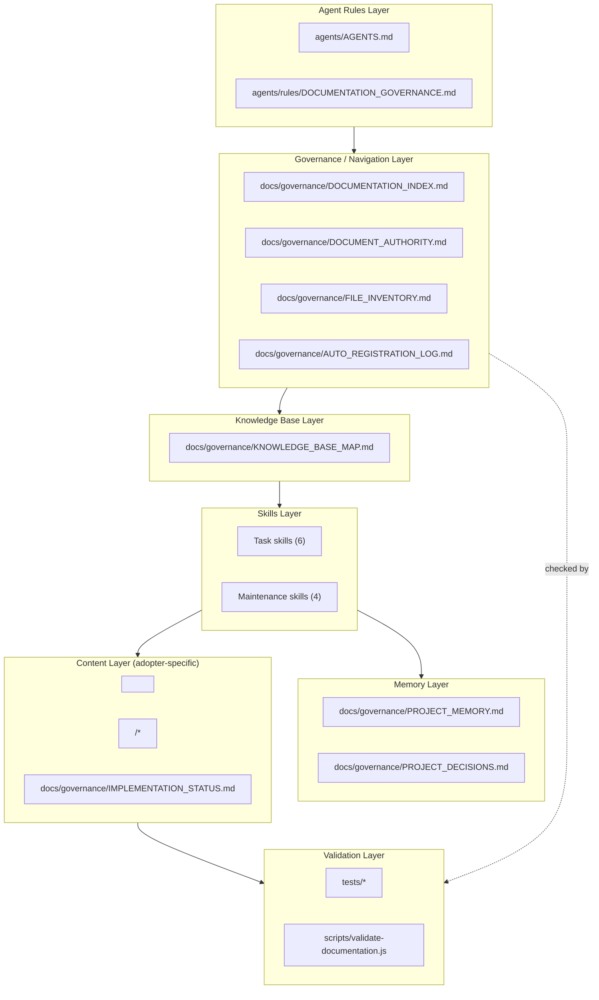

# Architecture

This document describes how the pieces of this framework fit together, and the single
invariant every other document in this repository exists to protect.

## The problem this framework solves

An AI agent answering questions from a documentation workspace will, by default, treat every
sentence it reads as equally true. It cannot tell:

- a *design intent* document from a *what actually shipped* record
- a current, authoritative spec from an old one nobody deleted
- two documents that quietly disagree
- a plan that was written and a plan that was executed

Left alone, this produces confident, well-cited, wrong answers — the agent isn't hallucinating
facts out of nowhere, it's faithfully reporting a document that was never true in production, or
was true once and has since been superseded. That failure mode is worse than a vague answer,
because it looks exactly as credible as a correct one.

## The one invariant that matters most

**A document describing a feature is never, by itself, evidence that the feature is built.**

An execution guide, a product spec, an architecture proposal, or a plan can be extremely
detailed and still describe something that was never implemented, was implemented differently,
or was implemented and later removed. Every skill in `agents/skills/` and every governance file
in `docs/governance/` is built to preserve this separation. See
`docs/governance/IMPLEMENTATION_STATUS.md` for the mechanism, and
`docs/examples/library-lending/IMPLEMENTATION_STATUS.md` for it applied to a concrete example.

## Layer diagram

## Component roles

| Layer | Files | Role |
|---|---|---|
| Agent Rules | `agents/AGENTS.md`, `agents/rules/DOCUMENTATION_GOVERNANCE.md` | Hard boundary: workspace scope, production-code exclusion, no-speculation rule. Read first, every session. |
| Governance / Navigation | `docs/governance/DOCUMENTATION_INDEX.md`, `DOCUMENT_AUTHORITY.md`, `FILE_INVENTORY.md`, `AUTO_REGISTRATION_LOG.md` | Where to look, which document wins, what exists, and a history of what was registered when. |
| Knowledge Base | `docs/governance/KNOWLEDGE_BASE_MAP.md` | Classifies every document into a domain (product requirements, architecture, API, schema, integrations, security, technical decisions, execution guides, memory, status) — see `KNOWLEDGE_MODEL.md`. |
| Skills | `agents/skills/*/SKILL.md` | Ten discrete, composable workflows an agent follows instead of improvising. Six are user-facing (task skills); four are invoked automatically by the task skills (maintenance skills) — see `WORKFLOW_MODEL.md`. |
| Memory | `docs/governance/PROJECT_MEMORY.md`, `PROJECT_DECISIONS.md` | Durable record of decisions, rejected approaches, and solved problems, so they survive past a single chat session. |
| Content (adopter-specific) | `<PRIMARY_AUTHORITY_DOCUMENT>`, `<EXECUTION_GUIDE_DIRECTORY>/*` | The actual product documentation this framework governs. In this repository, the bundled example (`docs/examples/library-lending/`) plays this role. |
| Validation | `tests/*`, `scripts/validate-documentation.js` | Proves the other six layers actually behave as designed, mechanically where possible. |

## Two operating modes

This framework is designed to run in one of two explicit modes — see
`docs/architecture/WORKFLOW_MODEL.md` §"Operating modes" for the full behavioral contract:

- **Documentation-only mode** — the agent never claims knowledge of what's actually running in
  production. It answers strictly from the documentation tree and states plainly when
  implementation cannot be verified.
- **Documentation + code verification mode** — the agent is explicitly granted access to a
  codebase and may cross-check documentation claims against it, clearly labeling which parts of
  an answer came from which source.

An agent must never silently switch from the first mode to the second — mode is declared by the
adopter, not inferred by the agent.

## Placeholders used throughout this repository

| Placeholder | Meaning |
|---|---|
| `<PROJECT_NAME>` | The name of the adopting project. |
| `<PROJECT_ROOT>` | The root directory the documentation-governance files live under in the adopter's repo (may be the repo root or a subdirectory). |
| `<PRODUCT_DOMAIN>` | A short description of what the product does, for classification prompts. |
| `<PRIMARY_AUTHORITY_DOCUMENT>` | The filename of the adopter's Tier 1 product specification — see `AUTHORITY_MODEL.md`. |
| `<EXECUTION_GUIDE_DIRECTORY>` | The directory holding the adopter's execution/implementation guides. |
| `<PRODUCTION_CODE_PATH>` | The adopter's application source-code location — named explicitly so it can be marked out-of-scope in `agents/rules/DOCUMENTATION_GOVERNANCE.md`. |

Only files under `docs/examples/` and `examples/` should ever contain concrete, non-placeholder
values — every other file in this repository is a reusable reference and must keep the
placeholders intact.
