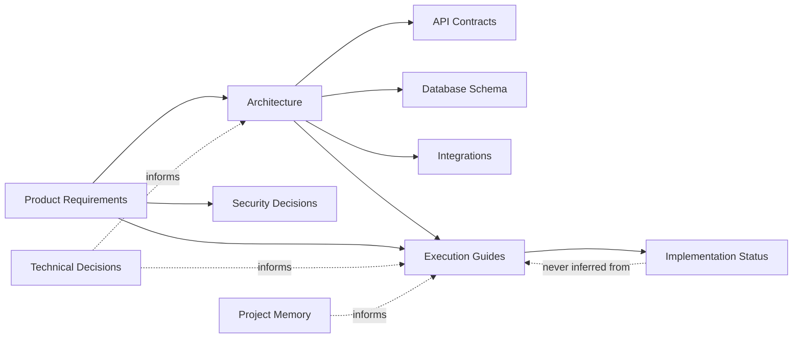

# Knowledge Model

Documentation sprawl happens when every kind of knowledge lives in the same undifferentiated
pile of Markdown files. This framework separates knowledge into ten domains. Every document in
the workspace belongs to exactly one primary domain (it may reference others), recorded in
`docs/governance/KNOWLEDGE_BASE_MAP.md`.

## The ten domains

| Domain | Answers the question | Example (Booklyn) |
|---|---|---|
| **Product Requirements** | What should the product do, and why? | `docs/examples/library-lending/PRODUCT_SPEC.md` |
| **Architecture** | How are the major subsystems structured? | `docs/architecture/ARCHITECTURE.md` (framework); a product would have its own |
| **API Contracts** | What are the request/response shapes and endpoints? | `docs/examples/library-lending/API_DESIGN.md` |
| **Database Schema** | What tables, columns, and relationships exist? | `docs/examples/library-lending/DATABASE_SCHEMA.md` |
| **Integrations** | What external systems does the product depend on, and how? | *(not populated in the bundled example — mark `NEEDS_VERIFICATION` if asked and absent)* |
| **Security Decisions** | What are the auth, permission, and data-protection rules? | Declared inline in `PRODUCT_SPEC.md` §Roles & Permissions |
| **Technical Decisions** | What was decided, and why, when more than one option existed? | `docs/governance/PROJECT_DECISIONS.md` |
| **Execution Guides** | What are the concrete steps to build a specific feature? | `docs/examples/library-lending/RENEWAL_RULES.md` |
| **Project Memory** | What problems were hit, and how were they solved? | `docs/governance/PROJECT_MEMORY.md` |
| **Implementation Status** | What is actually confirmed built vs. only documented? | `docs/governance/IMPLEMENTATION_STATUS.md`, `docs/examples/library-lending/IMPLEMENTATION_STATUS.md` |

## Why the separation matters

Each domain has a different **trust profile** and a different **staleness rate**:

- Product Requirements and Architecture change slowly and are usually still true months later.
- API Contracts and Database Schema change with every release and go stale fast — they need the
  tightest coupling to Implementation Status.
- Execution Guides are snapshots of intent at the time they were written; they are the domain
  most likely to describe something that was later changed or abandoned during actual build —
  which is exactly why an execution guide's existence must never be read as proof of shipped
  behavior (see `docs/architecture/ARCHITECTURE.md` §"The one invariant that matters most").
- Project Memory and Technical Decisions are append-only and historical by nature — they should
  never be silently rewritten, only superseded with a dated, explicit entry.
- Implementation Status is the only domain whose entire job is to say what's *actually true in
  production right now* — every other domain describes intent, plan, or history.

Treating these as one undifferentiated pile is exactly what causes an agent to answer "yes, the
product does X" by quoting an execution guide that was written, then changed, then never
updated.

## How the domains relate

The dotted line from Implementation Status back to Execution Guides is deliberate: knowledge
flows *into* an execution guide from requirements, architecture, and technical decisions, but
implementation status must never flow *out of* an execution guide by inference — it can only be
set by explicit confirmation or verification. See
`agents/skills/update-implementation-status/SKILL.md`.

## Classifying a new document

When a new document appears (see `docs/architecture/WORKFLOW_MODEL.md` for the full registration
workflow), classification into one of the ten domains is done from the document's own stated
purpose and content — never guessed from its filename alone. If a document doesn't cleanly fit
one domain, note the ambiguity in `docs/governance/KNOWLEDGE_BASE_MAP.md` rather than forcing a
classification that later misleads a reader searching by domain.
